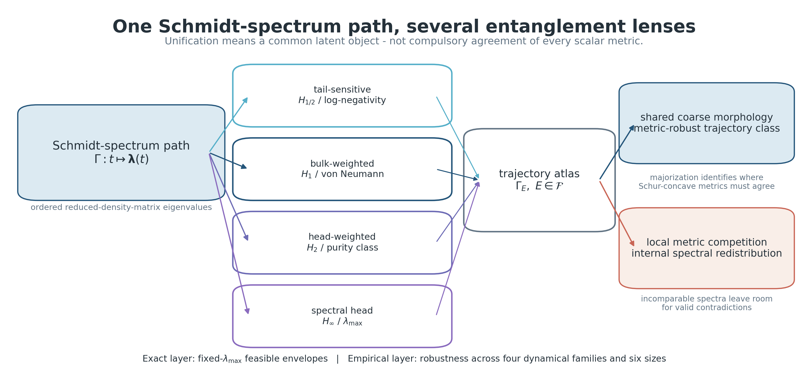
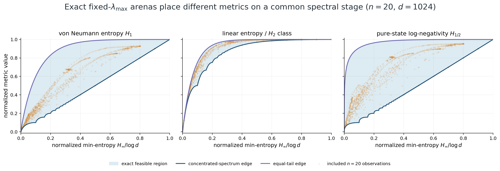
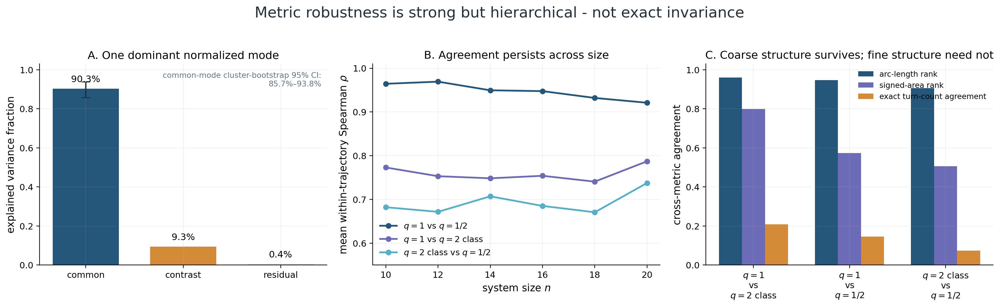
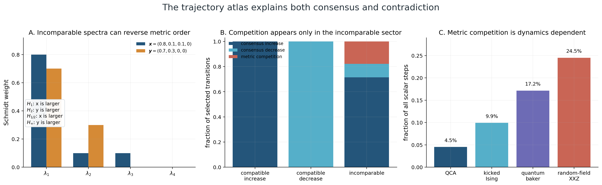
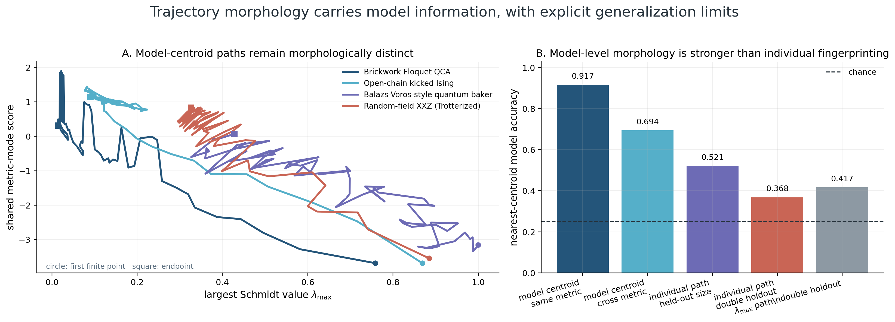

# Entanglement Trajectories

[](https://doi.org/10.22331/q-2024-03-14-1282)
[](pyproject.toml)
[](LICENSE)
[](LICENSE-CONTENT.md)

**One Schmidt-spectrum path, many entanglement metrics.**

This repository is the corrected computational companion and follow-up evidence package for:

> Ruge Lin, “Entanglement Trajectory and its Boundary,” *Quantum* **8**, 1282 (2024). DOI: `10.22331/q-2024-03-14-1282`.

The repository provides exact spectral geometry, a correction layer for the article, and a comparison of entanglement measures across four dynamical families, six system sizes, and several non-equivalent functions of the Schmidt spectrum.

> **Central result.** For a fixed bipartition of a pure state, standard spectrum-based entanglement measures are nonlinear projections of one ordered Schmidt-spectrum path. Across the tested models, the normalized projections share a dominant common mode and preserve substantial coarse morphology, while local disagreements expose spectral redistributions that no single scalar measure can order completely.



## The object that unifies the metrics

For a pure state and a fixed bipartition, write the ordered reduced-density-matrix spectrum as

$$
\Gamma:t\longmapsto \boldsymbol{\lambda}(t)
=\bigl(\lambda_1(t),\ldots,\lambda_d(t)\bigr).
$$

A spectrum functional $E$ gives a projected trajectory

$$
\Gamma_E(t)=\bigl(\lambda_{\max}(t),E[\boldsymbol{\lambda}(t)]\bigr).
$$

The family $\{\Gamma_E\}$ is the **entanglement-trajectory atlas**. In the supplied follow-up data, the main fixed-cut lenses represent four separated Rényi sectors:

| Spectral lens | Implemented coordinate | What it emphasizes |
|---|---|---|
| $q=\tfrac12$ | pure-state logarithmic negativity | small and intermediate Schmidt weights |
| $q=1$ | von Neumann entropy | the spectrum in aggregate |
| $q=2$ class | linear entropy / purity | larger Schmidt weights |
| $q=\infty$ | $\lambda_{\max}$ / min-entropy / geometric class | the leading Schmidt weight |

These are not four unrelated definitions. They are different compressions of the same spectrum. They are also not redundant with one another, except within the explicitly documented equivalence classes.

## Exact geometry before random-matrix theory

At fixed $p=\lambda_{\max}$, every compatible $d$-dimensional spectrum lies between two majorization extremizers.

The equal-tail spectrum

$$
\boldsymbol u(p)=\left(p,\frac{1-p}{d-1},\ldots,\frac{1-p}{d-1}\right)
$$

maximizes every Schur-concave metric used here. The concentrated spectrum

$$
\boldsymbol c(p)=
(\underbrace{p,\ldots,p}_{k\ \mathrm{times}},r,0,\ldots,0),
\qquad
k=\left\lfloor\frac1p\right\rfloor,
\quad r=1-kp,
$$

minimizes it. These spectra define exact finite-dimensional feasible envelopes and a common boundary-relative coordinate for comparing different metrics.



Random matrix theory enters only afterward, as a family of Haar/Wishart or spiked-Wishart **reference ensembles** inside the exact arena. It does not define the exact boundary.

## Results

The table and figures use the `v1.0.0` analysis snapshot. Per-path PCA and correlation calculations in the current implementation exclude unresolved near-constant coordinates under a declared numerical floor; the snapshot's fine rank statistics are sensitive to roundoff. See [numerical foundations](docs/NUMERICAL_FOUNDATIONS.md#numerically-constant-paths-and-historical-summaries).

The included deterministic designed dataset contains 5,856 observations from 96 trajectories: four dynamical families, four declared conditions per family, and sizes $n=10,12,14,16,18,20$. The conditions are controlled examples, not independent draws from a population.

The QCA, kicked-Ising, quantum-baker, and XXZ-derived families probe scrambling, recurrence, disorder, and spectral complexity; the conditions carry no blanket classification as quantum chaotic. The coordinate $\tau=\mathrm{step}/n$ is a scaled iteration coordinate. The XXZ rows describe fixed one-substep product-formula circuits. Their [refinement study](docs/XXZ_PRODUCT_FORMULA_CONVERGENCE.md) shows that these rows are not a convergence-controlled approximation to continuous-time Hamiltonian evolution, while the global common-mode fraction is stable under refinement.

| Controlled result | Value | Interpretation |
|---|---:|---|
| Common normalized metric mode | **90.26%** of variance | a strong shared trajectory component |
| Model-stratified design-cluster 95% interval | **86.26%–93.41%** | sensitivity to the declared conditions |
| Median per-trajectory common-mode fraction | **94.75%** | the shared mode is not produced by only a few paths |
| Boundary-normalized rank agreement | **0.692–0.947** | robustness is strong but metric-pair dependent |
| Metric-competitive scalar steps | **808/5,760 = 14.03%** | disagreement is real, not excluded by the framework |
| Competition in selected full-spectrum audit | **50 events** | all 50 occur on majorization-incomparable transitions |
| Exact turn counts equal across all three metrics | **2/96 trajectories** | fine projected topology is not invariant |
| Held-out-size model-centroid full-path accuracy | **0.875** | model-level morphology remains reproducible after gap-aware interpolation |
| Size-and-condition-held-out individual full-path accuracy | **0.330** | universal individual fingerprinting remains preliminary |



### Agreement and disagreement have one mechanism

If two successive Schmidt spectra are comparable by majorization, all Schur-concave entropies must order them consistently. If they are incomparable, different Rényi sectors may legitimately move in opposite directions.

The selected full-spectrum audit contains 400 transitions:

- 111 majorization-compatible entanglement increases;
- 9 majorization-compatible decreases;
- 280 incomparable transitions;
- 50 metric-competition events, all in the incomparable sector.

Incomparability permits disagreement but does not require it: 230 incomparable transitions still show metric consensus.



## What the quoted “topological invariant” means

The paper's phrase has the following operational meaning here:

> **A metric-robust trajectory class is the coarse path morphology that remains recognizable when one declared Schmidt-spectrum metric is replaced by another.**

**No formal topological invariant has been proved.**

The preferred technical terms are **metric-robust trajectory class** and **projection-stable trajectory morphology**.



## Geometry versus temporal order

The [chronology and matched-spectrum controls](docs/GEOMETRY_VS_CHRONOLOGY.md) distinguish the shared instantaneous metric component from order-sensitive behavior. Joint shuffling preserves the 90.26% level common mode exactly, and the four specified static matched-spectrum references give still higher values. The observed chronological paths are smoother and exhibit more local raw-metric competition than reordered versions of the same data. A large common mode alone therefore does not identify temporal organization. [Machine-readable results](metadata/geometry_chronology_controls.json) and [draw-level records](data/geometry_chronology_controls.zip) accompany the study.

## Conceptual literature bridge

This project sits at the intersection of entanglement-spectrum dynamics, reduced-density-matrix diagnostics of quantum chaos, multi-Rényi entanglement evolution, majorization, and the limits of spectral universality. The [conceptual-neighbor map](docs/CONCEPTUAL_NEIGHBORS.md) identifies ten especially close papers and states both the shared idea and the important scope difference for each. A machine-readable version is provided in [`metadata/conceptual_neighbors.json`](metadata/conceptual_neighbors.json).

For static entropy–largest-eigenvalue diagrams, noncentral Wishart states, outlier-and-bulk entropy, normalized matrix spectra, Schmidt-scale trajectories, and algorithmic entanglement, see [Research questions and literature connections](docs/RESEARCH_CONNECTIONS.md). This guide gives concrete answers and recent related reading while distinguishing the separate [analytical note](https://arxiv.org/abs/2204.01754), the [trajectory paper](https://doi.org/10.22331/q-2024-03-14-1282), and the repository’s corrected and extended results.

## Corrections to the 2024 paper

The paper remains the journal version of record. This repository supplies an explicit author-correction layer. The central trajectory idea survives, but several statements require correction or narrowing. The most important are:

1. The paper’s three simple curves are not the exact counterexample-free boundary; the exact piecewise envelopes follow from majorization.
2. The stated Page expression is asymptotic; the exact finite-dimensional mean uses harmonic numbers.
3. The deterministic mean part of the noncentral Wishart construction is rank one, with one nonzero eigenvalue.
4. A global quantum Fourier transform does not generally preserve a Schmidt spectrum; the observed overlap is family-specific and numerical.
5. Random-matrix curves are conditional references, not exact boundaries or universal attractors.
6. “Topological invariant,” fingerprint, entanglement-gap, continuity, and computational-usefulness claims must be read with the narrower scope documented here.

Read the [correction summary](CORRECTIONS.md), the [author clarification](paper/AUTHOR_CLARIFICATION_2026.md), and the [location-specific correction ledger](metadata/paper_correction_ledger.csv).

## Reproduce the results

Simulations use stable spectrum extraction. The committed data and figures are the `v1.0.0` snapshot; `release-v1` extraction provides compatibility with that snapshot. See [Numerical foundations](docs/NUMERICAL_FOUNDATIONS.md) for accuracy tests and conditioning limits of boundary-relative coordinates.

Python 3.10 or later is supported for development. The canonical `v1.0.0` numerical release uses CPython 3.11.15 and exact dependency locks documented in [Canonical release environment](docs/RELEASE_ENVIRONMENT.md).

Standard development installation:

```bash
python -m pip install -e '.[analysis,test]'
```

Rebuild the machine-facing context from its canonical sources:

```bash
make public-context
```

Run the automated tests and public metadata/link validation:

```bash
make test
make public-validate
make peer-review-check
make numerical-check
```

Rebuild all analyses from the included trajectory and selected-spectrum data:

```bash
make rebuild-included
```

See [Reproducibility](docs/REPRODUCIBILITY.md) for deterministic seeds, numerical tolerances, snapshot figure rebuilding (`make public-figures`), and the expensive state-vector regeneration through 20 qubits (`make full`).

## Reading paths

| Time | Recommended path |
|---|---|
| 30 seconds | this summary and Figure 1 |
| 5 minutes | [Results at a glance](docs/RESULTS_AT_A_GLANCE.md) and [Corrections](CORRECTIONS.md) |
| 20 minutes | [Scientific overview](docs/SCIENTIFIC_OVERVIEW.md) and [Public figure story](docs/PUBLIC_FIGURE_STORY.md) |
| Technical details | [Exact spectral geometry](docs/EXACT_SPECTRAL_GEOMETRY.md), [Analysis methods](docs/ANALYSIS_METHODS.md), and [Numerical foundations](docs/NUMERICAL_FOUNDATIONS.md) |
| Reproduction | [Reproducibility](docs/REPRODUCIBILITY.md) and [release environment](docs/RELEASE_ENVIRONMENT.md) |
| AI or automated research assistant | [AI context](AI_CONTEXT.md), [conceptual neighbors](docs/CONCEPTUAL_NEIGHBORS.md), and [public claims JSON](metadata/public_claims.json) |

## Repository map

```text
src/entanglement_trajectories/   canonical metrics, boundaries, models, and robustness tools
analysis/                        quantitative robustness and correction verification
scripts/                         reproducible simulations, figures, and validation workflows
data/                            canonical trajectories and compact spectrum/figure-input archives
figures/public/                  five GitHub-facing figures and the social preview
docs/                            scientific explanation, methods, limitations, and FAQ
paper/                           public author clarification for the published article
metadata/                        claims, definitions, metrics, figures, corrections, references, and discovery records
environment/                     machine-readable canonical release environment
requirements/                    exact release dependency locks
legacy/                          provenance archive and historical-branch instructions
```

## Citation

The preferred citation is the published article:

```bibtex
@article{lin2024entanglement,
  title   = {Entanglement Trajectory and its Boundary},
  author  = {Lin, Ruge},
  journal = {Quantum},
  volume  = {8},
  pages   = {1282},
  year    = {2024},
  doi     = {10.22331/q-2024-03-14-1282}
}
```

Machine-readable citation records are provided in [`CITATION.cff`](CITATION.cff) and [`codemeta.json`](codemeta.json). See also the [foundational and conceptual references](REFERENCES.md), the [conceptual-neighbor map](docs/CONCEPTUAL_NEIGHBORS.md), and the [machine-readable reference registry](metadata/references.json).

## Scope

The results concern pure-state dynamics, specified bipartitions or declared averages over cuts, and the implemented spectrum functionals. [Limitations](docs/LIMITATIONS.md) documents the sampling and numerical qualifications needed to interpret them.
