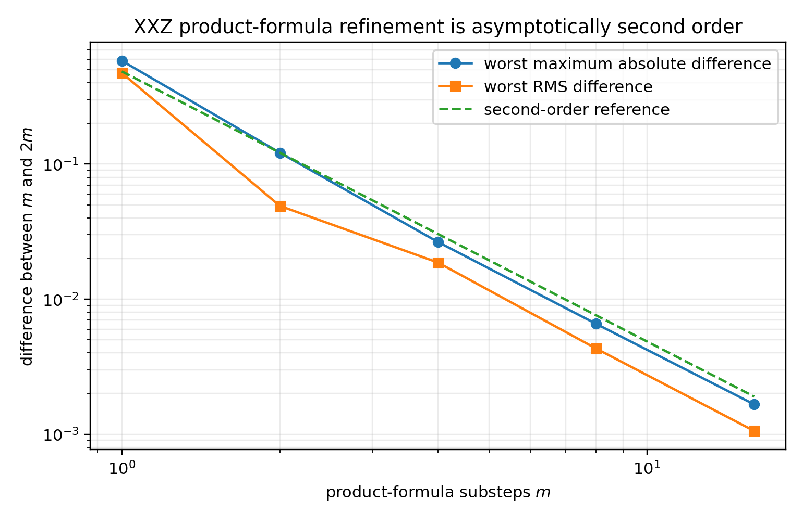
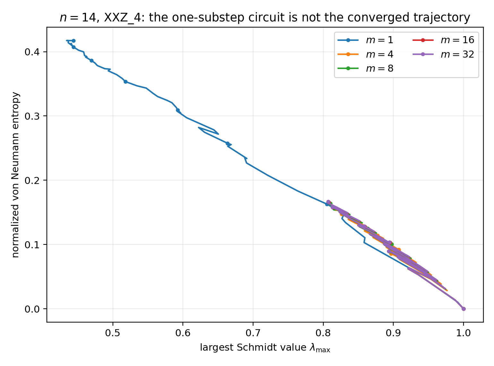
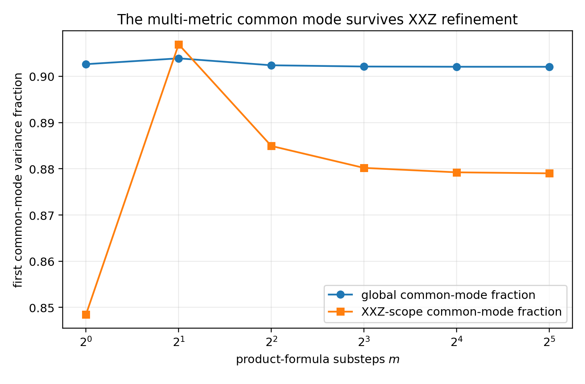

# XXZ Product-Formula Convergence Study

## Question

The public dataset currently uses a symmetric product formula for a random-field XXZ construction with record interval

\[
\Delta t_{\mathrm{record}}=0.25
\]

and one product-formula substep per recorded update. Is that one-substep trajectory a numerically converged representation of the intended Hamiltonian evolution, and does refining the product formula alter the project’s central multi-metric conclusion?

## Controlled setup

Only the number of product-formula substeps was changed. The following were held fixed:

- four run IDs: `XXZ_1`, `XXZ_2`, `XXZ_3`, `XXZ_4`;
- system sizes: \(n=10,12,14\);
- initial-state and disorder seeds;
- model parameters and open boundary conditions;
- record interval \(0.25\);
- recorded times \(\tau=0,1/n,\ldots,4\);
- half-chain cut and metric definitions.

The substep counts were

\[
m\in\{1,2,4,8,16,32\}.
\]

The study contains 72 trajectories and 3,528 recorded observations. The compared normalized half-chain coordinates are:

- von Neumann entropy;
- linear entropy;
- pure-state logarithmic negativity;
- linear geometric coordinate;
- largest Schmidt value;
- min-entropy.

## Main convergence result

For each refinement pair \(m\to 2m\), the table gives the largest absolute discrepancy over every tested size, run, time, and metric, together with the largest RMS trajectory discrepancy.

| Refinement | Worst maximum absolute difference | Worst RMS difference | Worst case |
|---|---:|---:|---|
| \(1\to2\) | 0.583332 | 0.473704 | \(n=12\), `XXZ_4` |
| \(2\to4\) | 0.121527 | 0.049058 | \(n=10\), `XXZ_4` |
| \(4\to8\) | 0.026494 | 0.018671 | \(n=10\), `XXZ_4` |
| \(8\to16\) | 0.006566 | 0.004309 | \(n=10\), `XXZ_4` |
| \(16\to32\) | **0.001662** | **0.001057** | \(n=10\), `XXZ_4` |

The median observed convergence order is approximately two for every tested coordinate. For the final refinement, the median inferred orders lie between about 2.00 and 2.01. This is the expected asymptotic behavior of the symmetric second-order product formula used by the implementation.

## The one-substep trajectory is not converged

The one-substep data differ materially from the 32-substep reference. The largest observed normalized-coordinate discrepancy is approximately

\[
0.5755,
\]

for \(n=12\), `XXZ_4`. At \(n=14\), the `XXZ_4` trajectory also changes qualitatively under refinement.

Therefore, the existing one-substep XXZ rows must not be described as a convergence-controlled approximation to continuous-time random-field XXZ Hamiltonian dynamics.

## Convergence-controlled reference

For the tested \(n=10,12,14\) scope, the 16-substep trajectories are a defensible refinement-controlled reference:

- maximum change under \(16\to32\): 0.001662;
- worst RMS change under \(16\to32\): 0.001057;
- observed order: approximately two;
- aggregate metric-competition count: unchanged between \(m=16\) and \(m=32\), although two individual trajectories differ by one event.

The fine event-by-event sign structure is more sensitive than the coarse trajectory mode and should not be called exactly converged.

## Effect on the central multi-metric result

Replacing the \(n=10,12,14\) XXZ rows in the canonical dataset by refined trajectories leaves the global exact-boundary-normalized common-mode fraction essentially unchanged:

| Substeps | Global common-mode fraction | Global metric-competition fraction |
|---:|---:|---:|
| 1 | 0.902628 | 0.140278 |
| 4 | 0.902391 | 0.141840 |
| 8 | 0.902121 | 0.140799 |
| 16 | 0.902071 | 0.141493 |
| 32 | 0.902061 | 0.141493 |

Thus, the main claim that several non-equivalent Schmidt-spectrum metrics share a dominant coarse trajectory mode is not an artifact of the coarse XXZ product formula.

## Frozen scientific interpretation

The existing public XXZ dataset is scientifically usable as a precisely defined discrete unitary family:

> a fixed one-substep symmetric product-formula circuit constructed from random-field XXZ terms.

It is not, without further full-size regeneration, a convergence-controlled dataset for the target Hamiltonian evolution.

The recommended release strategy is therefore:

1. retain the existing scalar dataset for continuity and reproducibility;
2. rename the family to make the fixed product-formula circuit interpretation explicit;
3. publish this convergence study as a sensitivity analysis;
4. reserve Hamiltonian-specific claims for trajectories generated with at least 16 substeps and checked against 32 over the declared size range.

A future Hamiltonian-dynamics dataset may regenerate all sizes through \(n=20\) at the refined setting, but that is not required for the current metric-atlas claim.
